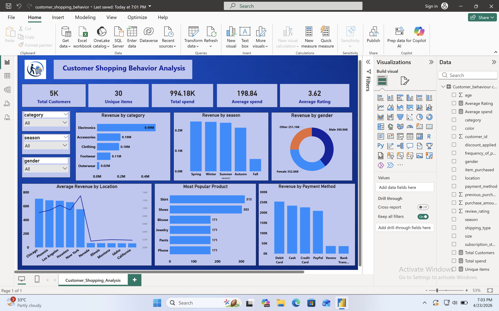

# customer_shopping_behavior_project_python_mysql_powerbi
🛒 Customer Behavior Analysis (Python + SQL + Power BI)
📌 Project Overview
This project analyzes customer shopping behavior to identify purchasing patterns, customer preferences, and revenue trends.
The analysis is performed using Python for data cleaning, SQL for querying, and Power BI for visualization.

🎯 Objective
Understand customer purchasing behavior
Identify high-value customers
Analyze revenue trends across categories, seasons, and locations
Build an interactive dashboard for business insights

🛠️ Tools & Technologies Used
Python (Pandas) → Data Cleaning
SQL → Data Analysis
Power BI → Dashboard & Visualization

🧹 Data Cleaning (Python)
Removed null values and duplicates
Converted data types (date format)
Renaming headers in snake_case format 
Handled inconsistent values
Connected to mysql 

🗃️ SQL Analysis
Performed various SQL queries to extract insights:
1 Which category generates highest revenue?
2. Revenue by Season
3. Category Contribution %
4. Gender-wise Spending
5. Segment customer into new, returning and loyal based on their total number of previous purchase, 
6. Revenue by Category
7. High Spending Customers (> avg)
8. Most Popular Product (by count)

📊 Dashboard (Power BI)
Key KPIs:
Total Customers: 5K
Total Spend: 994K
Average Spend: 198.84
Average Rating: 3.62
##Visualizations:
Revenue by Category
Revenue by Season
Revenue by Gender
Revenue by Location
Most Popular Products
Revenue by Payment Method

📸 Dashboard Preview

## 📈 Key Insights

- Total of **5K customers** analyzed with **994K+ total spend**
- **Electronics** category generates highest revenue
- **Spring and Winter seasons** show higher sales trends
- **Male customers** contribute slightly more revenue than female
- **Debit card** is the most used payment method
- **Shirts and Shoes** are the most popular products

## 📌 Features

- Interactive filters for category, season, and gender
- KPI cards for quick business overview
- Revenue analysis by category, season, and payment method
- Customer distribution by location

🚀 How to Run This Project
Open Python notebook and run data cleaning
Execute SQL queries for analysis
Open Power BI file to explore dashboard

